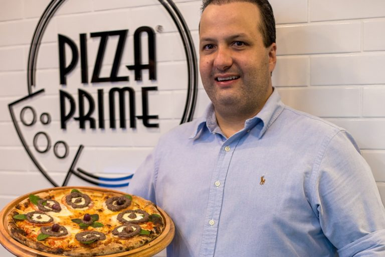
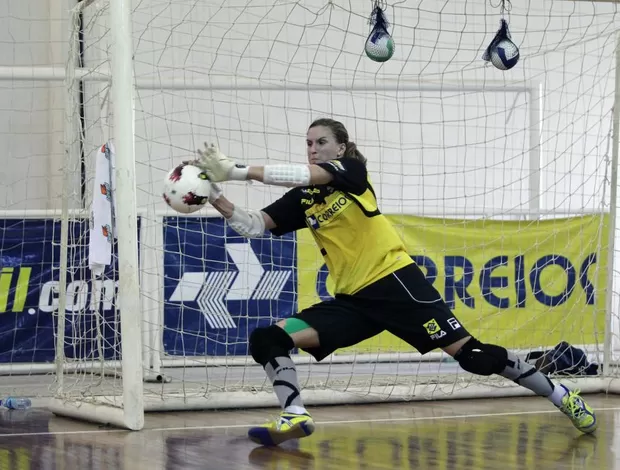
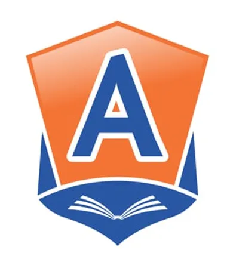
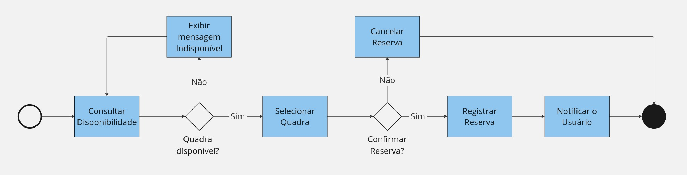
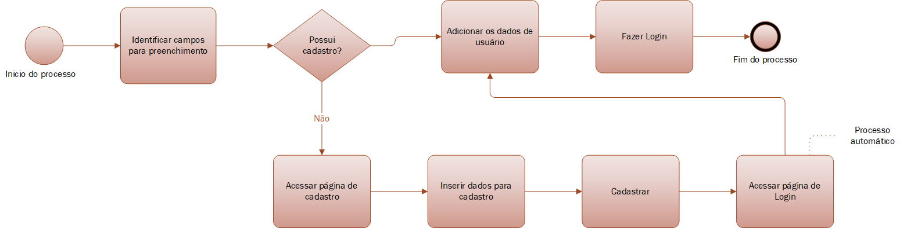
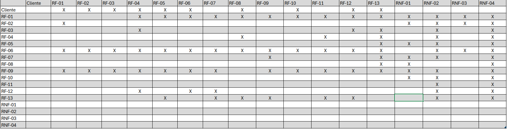
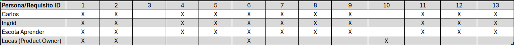
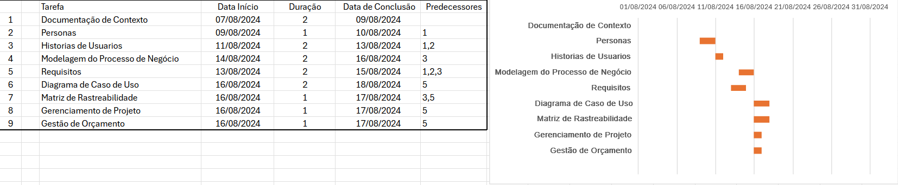
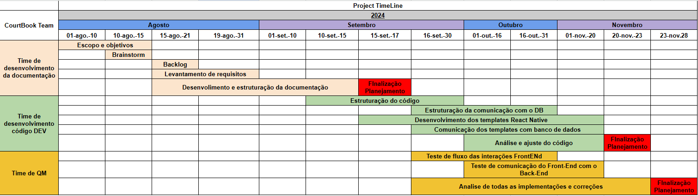
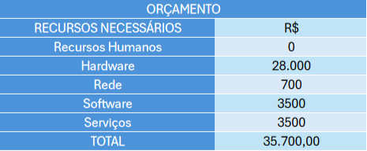

# Especificações do Projeto

Pré-requisitos: <a href="1-Documentação de Contexto.md"> Documentação de Contexto</a>

Definição do problema e ideia de solução a partir da perspectiva do usuário. É composta pela definição do  diagrama de personas, histórias de usuários, requisitos funcionais e não funcionais além das restrições do projeto.

Apresenta uma visão geral do que será abordado nesta parte do documento, enumerando as técnicas e/ou ferramentas utilizadas para realizar as especificações do projeto.

## Personas

|            | Carlos Eduardo                      | Ingrid Andrade                     | Escola Aprender                       |
|------------|-----------------------------------|------------------------------------|---------------------------------------|
|            | 

 | 

 | 

 |
| Idade      | 35                                | 28                                | 40+                                  |
| Ocupação   | Pizzaiolo e empreendedor, sócio da Pizza Prime | Enfermeira                         | Instituição de ensino                 |
| Aplicativos | ● Instagram   ● Flipboard   ● Linkedin | ● Instagram   ● Tiktok   ● Linkedin | ● Email   ● Google Drive   ● Calendário Escolar |
| Motivações | ● Busca eficiência em todos os aspectos da vida, incluindo o lazer.   ● Quer garantir que o tempo gasto com os amigos seja aproveitado ao máximo, sem complicações. | ● Apaixonada por enfermagem e esportes, especialmente futsal.   ● Quer otimizar seu tempo livre sem se preocupar com a desorganização nas reservas de quadras. | ● Proporcionar atividades recreativas para os alunos e a comunidade.   ● Precisa de uma solução eficiente para locação de quadras que minimize o tempo de gestão e maximize a utilização dos espaços. |
| Frustrações | ● A dificuldade em reunir amigos suficientes para jogar, muitas vezes levando ao cancelamento da reserva.   ● Lidar com atrasos nas reservas, impactando seu tempo livre limitado. | ● Dificuldade em organizar jogos de futsal com amigos devido a atrasos nas quadras. | ● A dificuldade em coordenar múltiplas reservas e garantir a disponibilidade das quadras para todos os interessados. |
| Hobbies | ● Jogos eletrônicos   ● Viagens   ● Corrida | ● Jogar futsal   ● Assistir Tiktok | ● Organizar eventos escolares   ● Parcerias comunitárias |
| História | Carlos Eduardo usa o aplicativo para alugar quadras e jogar com seus amigos, mas frequentemente enfrenta o desafio de cancelar as reservas porque não consegue reunir pessoas suficientes. Isso é frustrante, pois ele busca maximizar seu tempo livre e deseja um sistema que permita ajustar as reservas facilmente ou encontrar outros jogadores. | Ingrid se sentirá mais motivada e engajada com um sistema que facilite a reserva de quadras, permitindo que ela e seus amigos joguem futsal sem as frustrações típicas. O sistema eficiente garante que ela aproveite ao máximo seu tempo livre. | A Escola Aprender utiliza o sistema para locar quadras de forma organizada, garantindo que os eventos escolares e outras atividades esportivas sejam realizadas sem complicações. O sistema ajuda a otimizar o uso dos espaços e facilita a comunicação com a comunidade. |

## Histórias de Usuários

Com base na análise das personas forma identificadas as seguintes histórias de usuários:

<table>
<tbody>
<tr align=center>
<td width="250px"><b>EU COMO... QUEM</b></td>
<td width="350px"><b>QUERO/PRECISO ... O QUE</b></td>
<td width="250px"><b>PARA ... PORQUE</b></td>
</tr>
<tr>
<td>Ingrid Andrade</td>
<td>Agendar e locar uma quadra de futsal</td>
<td>Jogar futsal com os amigos</td>
</tr>
<tr>
<td>Ingrid Andrade</td>
<td>Conferir a data e horário do agendamento</td>
<td>Não aparecer no dia e horário incorretos</td>
</tr>
<tr>
<td>Ingrid Andrade</td>
<td>Encontrar o local agendado</td>
<td>Chegar e compartilhar a localização com os amigos</td>
</tr>
<tr>
<td>Carlos Eduardo</td>
<td>Alugar um campo de futebol</td>
<td>Criar um torneio de futebol</td>
</tr>
<tr>
<td>Carlos Eduardo</td>
<td>Cancelar o agendamento</td>
<td>Não fechou um grupo para os torneios</td>
</tr>
<tr>
<td>Escola Aprender</td>
<td>Locar uma quadra</td>
<td>Desenvolver uma gincana</td>
</tr>
<tr>
<td>Escola Aprender</td>
<td>Visualizar o espaço a ser usado</td>
<td>Atender as demandas necessárias</td>
</tr>
</tbody>
</table>

## Modelagem do Processo de Negócio

### Análise da Situação Atual

Atualmente, o processo de reserva de quadras de esportes é feito de maneira manual, com problemas como:

* Dificuldade na consulta de disponibilidade: Clientes precisam ligar ou visitar o local para verificar horários.

* Gerenciamento ineficiente de reservas: O registro manual em cadernos ou planilhas pode causar erros e conflitos de agendamento.

* Falta de visibilidade e controle: Administradores têm dificuldade em gerenciar as reservas e a disponibilidade das quadras em tempo real.

Esses problemas tornam o processo lento e propenso a erros, indicando a necessidade de uma solução automatizada.

### Descrição Geral da Proposta

A proposta é desenvolver uma aplicação web que automatize a consulta e a reserva de quadras de esportes, permitindo que os usuários vejam a disponibilidade e reservem quadras de forma rápida e eficiente. Para os administradores, a aplicação oferecerá uma interface para gerenciar as reservas e controlar a disponibilidade das quadras.

Limites da Proposta:

* A aplicação focará apenas na gestão de reservas, sem incluir a parte de pagamento.

Ligações com Estratégias e Objetivos do Negócio:

* Melhoria na Experiência do Cliente: Facilitar a consulta e reserva, tornando o processo mais acessível e menos demorado.

* Aumento da Eficiência Operacional: Reduzir erros e melhorar o controle sobre as reservas, aumentando a utilização das quadras.

Oportunidades de Melhoria:

* Redução do tempo necessário para reservar uma quadra.

* Eliminação de erros manuais no processo de reserva.

* Melhoria no controle e na gestão das quadras, com uma visão clara e em tempo real das operações.

### Processo 1 – CONSULTA E RESERVA DE QUADRA

Oportunidades de Melhoria:

* Automação do Processo de Consulta: Permitir que os clientes vejam a disponibilidade das quadras em tempo real;

* Reserva Automatizada: Implementar um sistema de reserva que evite conflitos de horário e garanta que os clientes possam realizar reservas de forma rápida e sem erros.

### Processo 2 – LOGIN E CADASTRO

* Acesso atráves do processo de Login: Permite que o usuário acesse o seus dados;
* Cadastro para acesso: Permite que o usuário insira seus dados para criar um acesso personalizado ao sistema.

## Indicadores de Desempenho

<table>
<tbody>
<tr align=center>
<td width="150px"><b>INDICADOR</b></td>
<td width="150px"><b>OBJETIVOS</b></td>
<td width="250px"><b>DESCRIÇÃO</b></td>
<td width="150px"><b>CÁLCULO</b></td>
<td width="150px"><b>FONTE DADOS</b></td>
<td width="150px"><b>PERSPECTIVA</b></td>
</tr>
<tr>
<td>Taxa de avaliação das quadras</td>
<td>Melhorar a qualidade quadras</td>
<td>Avaliar limpeza, estado do gramado sintético e/ou areia das respectivas quadras</td>
<td>Divida o número de avaliações positivas pelo total de avaliações e multiplique o resultado por 100</td>
<td>Sistema de avaliação via App</td>
<td>Clientes</td>
</tr>
<tr>
<td>Taxa de utilização do App</td>
<td>Tornar o App objetivo e prático</td>
<td>Utilizar indicadores de reserva pelo App para comparar com as reservas por telefone, entendendo como é a aceitação e utilização do App</td>
<td>Dividir o número de reservas feitas via App pelo total de reservas e multiplicar por 100: (NR/TR)*100</td>
<td>Comparativo entre reservas por telefone e via App</td>
<td>Melhoria dos processos de gestão</td>
</tr>
<tr>
<td>Percentual de reclamações</td>
<td>Avaliar quantidade de utilizações x quantidade de reclamações</td>
<td>Medir o % de reclamações de questões ocorridas da utilização das quadras</td>
<td>Dividir o número de reclamações pelo total de utilizações e multiplicar por 100: (NR/TU)*100</td>
<td>Rotina de abertura de reclamações no App</td>
<td>Melhoria dos processos internos</td>
</tr>
<tr>
<td>Taxa de cancelamento de reservas</td>
<td>Reduzir o número de cancelamentos</td>
<td>Monitorar a quantidade de reservas canceladas em relação ao total de reservas realizadas, identificando os motivos principais/td>
<td>(Número de cancelamentos / Total de reservas) * 100</td>
<td>Registros de cancelamentos no App.</td>
<td>Processos internos</td>
</tr>
<tr>
<td>Tempo médio de confirmação de reserva</td>
<td>Otimizar o tempo de resposta e agilidade do sistema de reservas</td>
<td>Avaliar quanto tempo, em média, leva para uma reserva ser confirmada, desde a solicitação até a confirmação final</td>
<td>Soma dos tempos de confirmação / Total de reservas confirmadas</td>
<td>Logs de transações de reservas</td>
<td>Melhoria da experiência do cliente</td>
</tr>
<tr>
<td>Taxa de retenção de clientes</td>
<td>Melhorar a fidelização dos clientes</td>
<td>Avaliar a quantidade de clientes que realizam múltiplas reservas em um determinado período, ajudando a entender o nível de satisfação</td>
<td>(Número de clientes que fizeram mais de uma reserva / Total de clientes) * 100</td>
<td>Histórico de reservas dos usuários no App</td>
<td>Clientes</td>
</tr>
</tbody>
</table>

## Requisitos

As tabelas que se seguem apresentam os requisitos funcionais e não funcionais que detalham o escopo do projeto. Para determinar a prioridade de requisitos, aplicar uma técnica de priorização de requisitos e detalhar como a técnica foi aplicada.

### Requisitos Funcionais

<table>
<tbody>
<tr align=center>
<td width="150px"><b>ID</b></td>
<td width="500px"><b>Descrição do Requisito</b></td>
<td width="150px"><b>Prioridade</b></td>
</tr>
<tr>
<td>RF-001</td>
<td>Deve permitir aos usuários fazerem login</td>
<td>Alta</td>
</tr>
<tr>
<td>RF-002</td>
<td>Deve permitir aos usuários que se cadastrem no aplicativo</td>
<td>Alta</td>
</tr>
<tr>
<td>RF-003</td>
<td>O sistema de agendamento deve reiniciar de semana em semana</td>
<td>Alta</td>
</tr>
<tr>
<td>RF-004</td>
<td>Deve permitir ao cliente visualizar os dias e horários vagos nas quadras</td>
<td>Alta</td>
</tr>
<tr>
<td>RF-005</td>
<td>Deve permitir ao cliente cancelar um agendamento</td>
<td>Média</td>
</tr>
<tr>
<td>RF-006</td>
<td>Deve haver duas interfaces, uma para os clientes e outra para a gerência</td>
<td>Alta</td>
</tr>
<tr>
<td>RF-007</td>
<td>Deve permitir ao cliente visualizar os tipos de quadra pela sua categoria</td>
<td>Média</td>
</tr>
<tr>
<td>RF-008</td>
<td>O sistema deve informar e/ou avisar ao cliente sobre o agendamento</td>
<td>Média</td>
</tr>
<tr>
<td>RF-009</td>
<td>Deve permitir o cliente navegar entre as páginas da aplicação</td>
<td>Alta</td>
</tr>
<tr>
<td>RF-010</td>
<td>Deve permitir, na interface de gerência, visualizar e controlar o sistema de agendamento</td>
<td>Alta</td>
</tr>
<tr>
<td>RF-011</td>
<td>Deve permitir ao usuário qualificar o espaço usado</td>
<td>Baixa</td>
</tr>
<tr>
<td>RF-012</td>
<td>Deve permitir ao usuário visualizar o espaço a ser locado</td>
<td>Média</td>
</tr>
<tr>
<td>RF-013</td>
<td>Deve permitir ao usuário agendar o espaço</td>
<td>Alta</td>
</tr>
</tbody>
</table>

### Requisitos não Funcionais

<table>
<tbody>
<tr align=center>
<td width="150px"><b>ID</b></td>
<td width="500px"><b>Descrição do Requisito</b></td>
<td width="150px"><b>Prioridade</b></td>
</tr>
<tr>
<td>RNF-01</td>
<td>As requisições e interações dentro do aplicativo devem ser rápidas para agilizar e facilitar o processo</td>
<td>Alta</td>
</tr>
<tr>
<td>RNF-02</td>
<td>O aplicativo deve ser intuitivo para pessoas sem experiência</td>
<td>Média</td>
</tr>
<tr>
<td>RNF-03</td>
<td>O sistema deve estar em conformidade com as regulamentações estabelecidas pela Lei Geral de Proteção de Dados (LGPD)</td>
<td>Alta</td>
</tr>
<tr>
<td>RNF-04</td>
<td>Deve ser desenvolvido utilizando ReactNative</td>
<td>Alta</td>
</tr>
</tbody>
</table>

## Restrições

O projeto está restrito pelos itens apresentados na tabela a seguir.

<table>
<tbody>
<tr align=center>
<td width="150px"><b>ID</b></td>
<td width="500px"><b>Descrição do Requisito</b></td>
</tr>
<tr>
<td>RE-01</td>
<td>O projeto deverá ser entregue no final do semestre letivo, não podendo extrapolar a data de 08/12/24</td>
</tr>
<tr>
<td>RE-02</td>
<td>A equipe não pode subcontratar o desenvolvimento do trabalho</td>
</tr>
<tr>
<td>RE-03</td>
<td>O sistema deve ser desenvolvido em ReactNative com auxílio do Expo</td>
</tr>
</tbody>
</table>

## Diagrama de Casos de Uso

# Matriz de Rastreabilidade

Essa matriz de rastreabilidade é  usada para facilitar a visualização dos relacionamento entre requisitos e outros artefatos ou objetos, permitindo a rastreabilidade entre os requisitos e os objetivos de negócio.

Essa matriz relaciona os requisitos funcionais com as personas.

# Gerenciamento de Projeto

De acordo com o PMBoK v6 as dez áreas que constituem os pilares para gerenciar projetos, e que caracterizam a multidisciplinaridade envolvida, são: Integração, Escopo, Cronograma (Tempo), Custos, Qualidade, Recursos, Comunicações, Riscos, Aquisições, Partes Interessadas. Para desenvolver projetos um profissional deve se preocupar em gerenciar todas essas dez áreas. Elas se complementam e se relacionam, de tal forma que não se deve apenas examinar uma área de forma estanque. É preciso considerar, por exemplo, que as áreas de Escopo, Cronograma e Custos estão muito relacionadas. Assim, se eu amplio o escopo de um projeto eu posso afetar seu cronograma e seus custos.

## Gerenciamento de Tempo

Na imagem abaixo é possível visualizar todas as tarefas com suas respectivas datas de início,término e duração.

O gráfico de Gantt ou diagrama de Gantt também é uma ferramenta visual utilizada para controlar e gerenciar o cronograma de atividades de um projeto. Com ele, é possível listar tudo que precisa ser feito para colocar o projeto em prática, dividir em atividades e estimar o tempo necessário para executá-las.

## Gerenciamento de Equipe

O gerenciamento adequado de tarefas contribuirá para que o projeto alcance altos níveis de produtividade. Por isso, é fundamental que ocorra a gestão de tarefas e de pessoas, de modo que os times envolvidos no projeto possam ser facilmente gerenciados.

## Gestão de Orçamento

Abaixo é possível visualizar o orçamento do projeto.Foram considerados para construção desse orçamento,escopo,tempo,serviços como hospedagem e banco de dados,hardwares como notebooks pessoais para que possa haver o desenvolvimento e despesas com internet entre outras coisas. 

