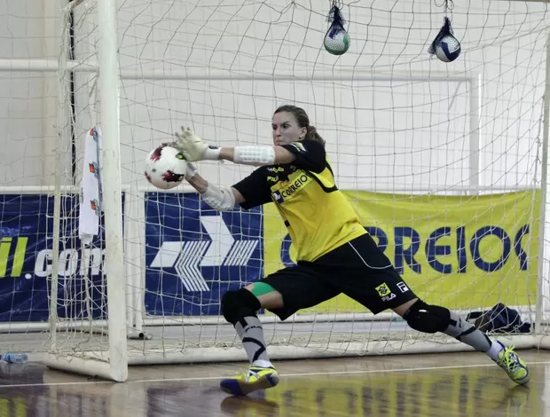
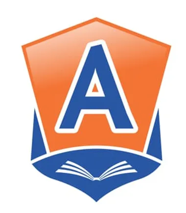
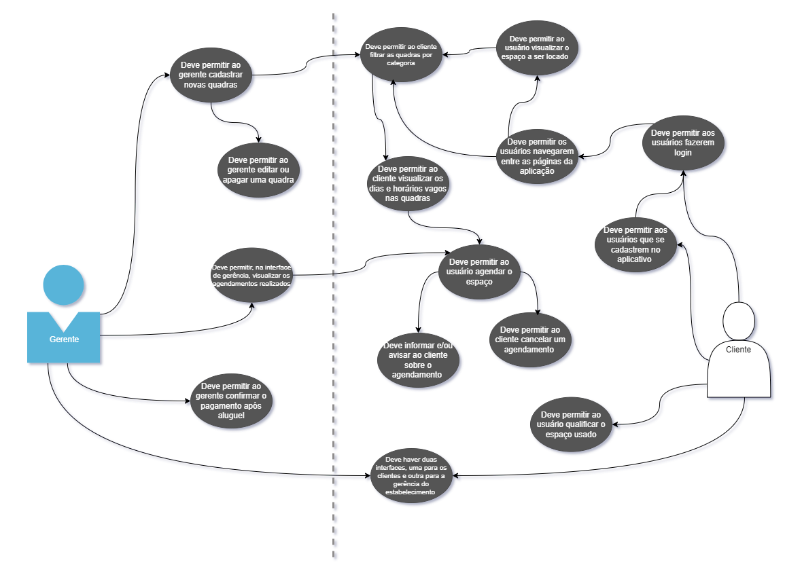

# Especificações do Projeto

Pré-requisitos: <a href="1-Documentação de Contexto.md"> Documentação de Contexto</a>

Definição do problema e ideia de solução a partir da perspectiva do usuário. É composta pela definição do  diagrama de personas, histórias de usuários, requisitos funcionais e não funcionais além das restrições do projeto.

Apresente uma visão geral do que será abordado nesta parte do documento, enumerando as técnicas e/ou ferramentas utilizadas para realizar a especificações do projeto

## Personas

|            | Carlos Eduardo                      | Ingrid Andrade                     | Ginásio Agilize                       |
|------------|-----------------------------------|------------------------------------|---------------------------------------|
|            | 

 | 

 | 

 |
| Idade      | 48                                | 24                                | 10+                                  |
| Ocupação   | Pizzaiolo e empreendedor, sócio da Pizza Prime | Enfermeira                         | Ginásio                 |
| Aplicativos | ● Instagram   ● Flipboard   ● Linkedin | ● Instagram   ● Tiktok   ● Linkedin | ● Email   ● Google Drive   ● Instagram |
| Motivações | ● Busca eficiência em todos os aspectos da vida, incluindo o lazer.   ● Quer garantir que o tempo gasto com os amigos seja aproveitado ao máximo, sem complicações. | ● Apaixonada por enfermagem e esportes, especialmente futsal.   ● Quer otimizar seu tempo livre sem se preocupar com a desorganização nas reservas de quadras. | ● Proporcionar atividades recreativas para os clientes.   ● Precisa de uma solução eficiente para locação de quadras que minimize o tempo de gestão e maximize a utilização dos espaços. |
| Frustrações | ● A dificuldade em reunir amigos suficientes para jogar, muitas vezes levando ao cancelamento da reserva.   ● Lidar com atrasos nas reservas, impactando seu tempo livre limitado. | ● Dificuldade em organizar jogos de futsal com amigos devido a atrasos nas quadras. | ● A dificuldade em coordenar múltiplas reservas e garantir a disponibilidade das quadras para todos os interessados. |
| Hobbies | ● Jogos eletrônicos   ● Viagens   ● Corrida | ● Jogar futsal   ● Assistir Tiktok | ● Organizar eventos   ● Parcerias comunitárias |
| História | Carlos Eduardo quer um aplicativo para alugar quadras e jogar com seus amigos, mas enfrenta o desafio de cancelar reservas quando não consegue reunir pessoas suficientes. Ele busca um sistema que permita ajustar as reservas facilmente ou encontrar outros jogadores para evitar frustrações e aproveitar melhor seu tempo livre. | Ingrid deseja um sistema que facilite a reserva de quadras, permitindo que ela e seus amigos joguem futsal sem complicações. Um sistema eficiente ajudaria a eliminar frustrações e garantir que ela aproveite ao máximo seu tempo livre. | O Ginásio Agilize precisa de um sistema para locar quadras de forma organizada, garantindo que os eventos e outras atividades esportivas sejam realizados sem complicações. Um sistema eficiente ajudaria a otimizar o uso dos espaços e a facilitar a comunicação com os clientes. |

## Histórias de Usuários

Com base na análise das personas forma identificadas as seguintes histórias de usuários:

|EU COMO... `PERSONA`| QUERO/PRECISO ... `FUNCIONALIDADE` |PARA ... `MOTIVO/VALOR`                 |
|--------------------|------------------------------------|----------------------------------------|
|Cliente (Carlos/Ingrid)| Criar uma conta no aplicativo | Acessar as funcionalidades de reserva de quadras |
|Cliente (Carlos/Ingrid)| Fazer login no aplicativo usando minhas credenciais | Acessar minha conta e minhas reservas |
|Cliente (Carlos/Ingrid)| Navegar facilmente entre as diferentes seções do aplicativo | Encontrar rapidamente as informações que preciso |
|Cliente (Carlos)| Filtrar quadras por categoria (ex: futsal, basquete) | Encontrar o tipo de quadra que me interessa |
|Cliente (Ingrid)| Visualizar informações detalhadas e fotos das quadras disponíveis | Determinar se atendem às minhas necessidades antes de reservar |
|Cliente (Carlos)| Ver quais dias e horários estão disponíveis para cada quadra | Planejar minha reserva adequadamente |
|Cliente (Ingrid)| Reservar uma quadra para uma data e horário específicos | Garantir o espaço para meu jogo de futsal |
|Cliente (Carlos)| Receber confirmação da minha reserva | Ter certeza de que minha reserva foi bem-sucedida |
|Cliente (Carlos/Ingrid)| Receber lembretes sobre minhas reservas próximas | Não esquecer e evitar atrasos nos jogos agendados |
|Cliente (Carlos/Ingrid)| Reportar ou visualizar atrasos em reservas | Planejar melhor meu tempo e evitar esperas desnecessárias |
|Cliente (Ingrid)| Cancelar minha reserva se meus planos mudarem | Não perder dinheiro ou impedir que outros usem a quadra |
|Cliente (Carlos)| Avaliar e revisar a quadra após utilizá-la | Compartilhar minha experiência com outros usuários e com a administração |
|Cliente (Carlos)| Buscar ou convidar outros usuários para jogar | Completar meu time quando não consigo reunir amigos suficientes |
|Cliente (Carlos/Ingrid)| Escolher entre diferentes métodos de pagamento | Utilizar a opção que for mais conveniente para mim |
|Gerente (Ginásio Agilize)| Ter uma interface separada dos clientes | Gerenciar as operações da instalação de forma eficiente |
|Gerente (Ginásio Agilize)| Adicionar novas quadras ao sistema | Permitir que os clientes as reservem |
|Gerente (Ginásio Agilize)| Editar detalhes das quadras ou removê-las do sistema | Manter as informações atualizadas |
|Gerente (Ginásio Agilize)| Visualizar todas as reservas em formato de calendário ou lista | Gerenciar a disponibilidade e o agendamento das quadras |
|Gerente (Ginásio Agilize)| Marcar reservas como pagas após receber o pagamento | Acompanhar a receita e confirmar transações concluídas |
|Gerente (Ginásio Agilize)| Registrar e monitorar atrasos nas reservas | Otimizar o uso das quadras e melhorar a experiência dos clientes |
|Gerente (Ginásio Agilize)| Visualizar relatórios de utilização das quadras | Identificar horários de pico e baixa demanda para otimizar a operação |

## Requisitos

|ID    | Descrição do Requisito  | Prioridade | Responsável |
|------|-----------------------------------------|----|----|
|RF-001|	Deve permitir aos usuários fazerem login.| Alta |----|
|RF-002| Deve permitir aos usuários que se cadastrem no aplicativo.| Alta |----|
|RF-003|	Deve permitir os usuários navegarem entre as páginas da aplicação. | Alta |----|
|RF-004|	Deve haver duas interfaces, uma para os clientes e outra para a gerência do estabelecimento.| Alta |----|
|RF-005|	Deve permitir ao gerente cadastrar novas quadras.| Média |----|
|RF-006| Deve permitir ao gerente editar ou apagar uma quadra.| Média |----|
|RF-007| Deve permitir, na interface de gerência, visualizar os agendamentos realizados.| Alta |----|
|RF-008|	Deve permitir ao gerente confirmar o pagamento após aluguel.| Alta |----|
|RF-009|	Deve permitir ao cliente filtrar as quadras por categoria.| Média |----|
|RF-010|	Deve permitir ao usuário visualizar o espaço a ser locado.| Alta |----|
|RF-011|	Deve permitir ao cliente visualizar os dias e horários vagos nas quadras.| Alta |----|
|RF-012|	Deve permitir ao usuário agendar o espaço.| Alta |----|
|RF-013|	Deve informar e/ou avisar ao cliente sobre o agendamento.| Alta |----|
|RF-014|	Deve permitir ao cliente cancelar um agendamento.| Alta |----|
|RF-015|	Deve permitir ao usuário qualificar o espaço usado.| Média |----|

## Requisitos não Funcionais

|ID    | Descrição do Requisito  | Prioridade |
|------|-----------------------------------------|----|
|RNF-001| As requisições e interações dentro do aplicativo devem ser rápidas para agilizar e facilitar o processo.| Alta |
|RNF-002| O aplicativo deve ser intuitivo para pessoas sem experiência.| Média |
|RNF-003| O sistema deve estar em conformidade com as regulamentações estabelecidas pela Lei Geral de Proteção de Dados (LGPD).| Alta |
|RNF-004| Deve ser desenvolvido de forma distribuida.| Alta |
|RNF-005| O sistema deve garantir alta disponibilidade, minimizando o tempo de inatividade para não comprometer a experiência do usuário.| Alta |
|RNF-006| O aplicativo deve ser compatível com dispositivos Android e iOS, garantindo uma experiência uniforme em ambas as plataformas.| Alta |

## Restrições

|ID    | Descrição do Requisito  |
|------|-----------------------------------------|
|RE-01|	O projeto deve ser entregue ao término do semestre letivo.|
|RE-02|	O desenvolvimento do trabalho deve ser realizado exclusivamente pelo grupo, sendo proibida a participação de terceiros.|
## Diagrama de Casos de Uso

# Gerenciamento de Projeto

De acordo com o PMBoK v6 as dez áreas que constituem os pilares para gerenciar projetos, e que caracterizam a multidisciplinaridade envolvida, são: Integração, Escopo, Cronograma (Tempo), Custos, Qualidade, Recursos, Comunicações, Riscos, Aquisições, Partes Interessadas. Para desenvolver projetos um profissional deve se preocupar em gerenciar todas essas dez áreas. Elas se complementam e se relacionam, de tal forma que não se deve apenas examinar uma área de forma estanque. É preciso considerar, por exemplo, que as áreas de Escopo, Cronograma e Custos estão muito relacionadas. Assim, se eu amplio o escopo de um projeto eu posso afetar seu cronograma e seus custos.

## Gerenciamento de Tempo
Na imagem abaixo é possível visualizar todas as tarefas com suas respectivas datas de início, término e duração, o gerente de projetos agenda e coordena tarefas dentro de um projeto para estimar o tempo necessário de conclusão.

O gráfico de Gantt ou diagrama de Gantt também é uma ferramenta visual utilizada para controlar e gerenciar o cronograma de atividades de um projeto. Com ele, é possível listar tudo que precisa ser feito para colocar o projeto em prática, dividir em atividades e estimar o tempo necessário para executá-las.

## Gerenciamento de Equipe

O gerenciamento adequado de tarefas contribuirá para que o projeto alcance altos níveis de produtividade. Por isso, é fundamental que ocorra a gestão de tarefas e de pessoas, de modo que os times envolvidos no projeto possam ser facilmente gerenciados. 

