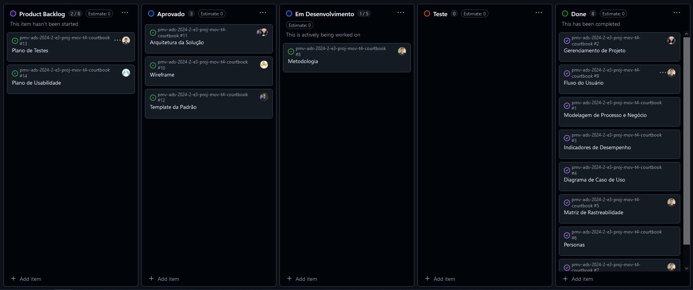
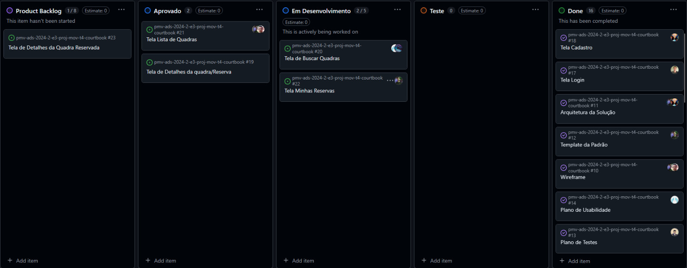
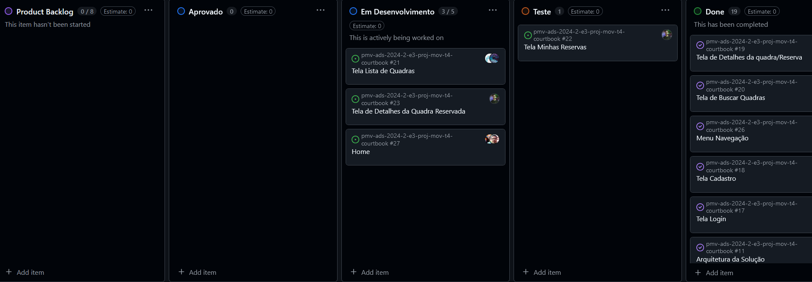
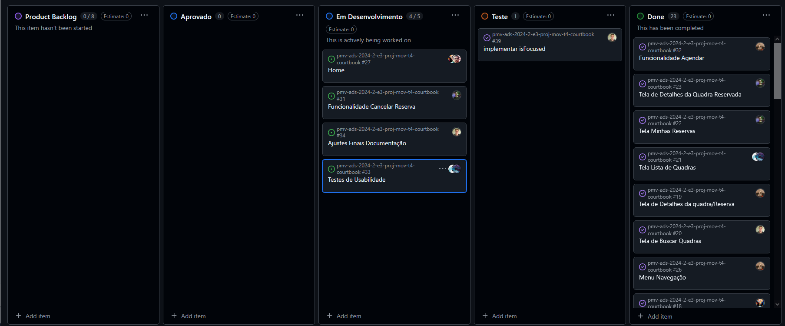

# Metodologia

Pré-requisitos: <a href="2-Especificação do Projeto.md"> Documentação de Especificação</a>

## Relação de Ambientes de Trabalho

<table> <tbody> <tr align=center> <td width="250px"><b>Plataforma</b></td> <td width="350px"><b>Ambiente</b></td> <td width="250px"><b>Link</b></td> </tr> <tr> <td>VSCode</td> <td>Desktop</td> <td><a href="https://code.visualstudio.com" target="_blank">Acessar VSCode</a></td> </tr> <tr> <td>Discord</td> <td>Desktop</td> <td><a href="https://discord.com" target="_blank">Acessar Discord</a></td> </tr> <tr> <td>Microsoft Teams</td> <td>Desktop</td> <td><a href="https://www.microsoft.com/pt-br/microsoft-teams/free" target="_blank">Acessar Teams</a></td> </tr> <tr> <td>Whatsapp</td> <td>Mobile ou Web</td> <td><a href="https://web.whatsapp.com/" target="_blank">Acessar Whatsapp Web</a></td> </tr> <tr> <td>Miro</td> <td>Web</td> <td><a href="https://miro.com/pt/" target="_blank">Acessar Miro</a></td> </tr> <tr> <td>Figma</td> <td>Web</td> <td><a href="https://www.figma.com" target="_blank">Acessar Figma</a></td> </tr> <tr> <td>Excel</td> <td>Desktop ou Web</td> <td><a href="https://www.office.com" target="_blank">Acessar Excel</a></td> </tr> <tr> <td>React Native</td> <td>Mobile</td> <td><a href="https://reactnative.dev/" target="_blank">Acessar documentação</a></td> </tr> </tbody> </table>

## Controle de Versão

A ferramenta de controle de versão adotada no projeto foi o
[Git](https://git-scm.com/), sendo que o [Github](https://github.com)
foi utilizado para hospedagem do repositório.

O projeto segue a seguinte convenção para o nome de branches:

- `main`: versão estável já testada do software
- `develop`: versão já testada do software, porém instável
- `dev-task`: Cada Dev terá sua branch de acordo com sua tarefa atual,dificultando problemas com conflito na hora do merge

Quanto à gerência de issues, o projeto adota a seguinte convenção para
etiquetas:

- `Documentação`: melhorias ou acréscimos à documentação
- `bug`: uma funcionalidade encontra-se com problemas
- `Melhoria`: uma funcionalidade precisa ser melhorada
- `Desenvolvimento`: uma nova funcionalidade precisa ser introduzida

Essa configuração de divisão de branchs e de issues foi a melhor forma encontrada para minimizar a possibilidade de erros,tanto no momento do merge com as branch "develop" e "main",quanto no momento de gerenciar as tarefas,agilizando e facilitando o desenvolvimento do aplicativo.

Cada dev terá sua branch de sua respectiva tarefa,ele criará esse branch originada da main,para que sua branch local possa ser a mais atualizada de maneira estável,assim podendo dar inicio a sua tarefa.Ao final da sua tarefa o código será implementado na branch develop para que possa ser testado e após os testes será feito o merge com o main,esse ciclo será repetido até o final do projeto.

## Gerenciamento de Projeto

### Divisão de Papéis

Apresente a divisão de papéis entre os membros do grupo.

Exemplificação: A equipe utiliza metodologias ágeis, tendo escolhido o Scrum como base para definição do processo de desenvolvimento. A equipe está organizada da seguinte maneira:
- Scrum Master: Pedro Nogueira;
- Product Owner: Siderley Tadeu;
- Equipe de Desenvolvimento: Vitor Galinari, Amaury Magno, Gustavo Braga, Alvaro Henrique, Tomaz Martins;
- Equipe de Design: Alvaro Henrique e Gustavo Braga.

### Processo

Abaixo é possível ver o quadro de tarefas com o andamento dos cards e seus status no momento em que foi tirado o print (Etapa 2) ,mostrando os integrantes responsáveis pela tarefa e quais tarefas já foram concluídas.

Abaixo é possível ver o quadro de tarefas com o andamento dos cards e seus status no momento em que foi tirado o print (Etapa 3) ,mostrando os integrantes responsáveis pela tarefa e quais tarefas já foram concluídas.

Registro: Após a equipe enfrentar problemas com a organização, foi definido que haveria uma reuniao semanal com os integrantes para alinhamento de tarefas e o andamento do projeto, apesar desses problemas a equipe conseguiu entregar duas funcionalidades do sistema durante essa etapa. 

Abaixo é possível ver o quadro de tarefas com o andamento dos cards e seus status no momento em que foi tirado o print (Etapa 4) ,mostrando os integrantes responsáveis pela tarefa e quais tarefas já foram concluídas.

Registro: A etapa 4 foi uma etapa de grandes desafios externos,pois todos os integrantes não conseguiram dar total atenção ao desenvolvimento,seja por motivos pessoais ou profissionais apesar de tudo conseguimos progredir com as funcionalidades mesmo que não tenha sáido como esperado evoluimos o projeto significamente.

Registro: Na etapa 5 a equipe se concentrou nos ultimos ajustes do sistema e da documentação,procurando possíveis falhas e melhorias que possam ser implementadas. Com o sistema 100% funcional começamos a aplicar os testes de usabilidade com usuários reais para receber feedbacks que possam nos ajudar a encontrar alguma falha ou melhoria citada acima.

A conclusão é do trabalho é que foi um sucesso,conseguimos chegar no resultado esperado,com uma aplicação 100% funcional dentro das limitações do projeto atendemos a maioria dos requisitos registrados e entregamos um sistema confiavel e performático.

### Ferramentas

As ferramentas empregadas no projeto são:

- Editor de código => VSCode.
- Ferramentas de comunicação => Discord, Whatsapp, Microsoft Teams
- Ferramentas de desenho de tela => Figma
- Outras Ferramentas utilizadas => Miro,Canvas e Excel

O editor de código foi escolhido porque ele possui uma integração com o sistema de versão. As ferramentas de comunicação utilizadas possuem integração semelhante e por isso foram selecionadas. Por fim, para criar diagramas utilizamos essa ferramenta por melhor captar as necessidades da nossa solução.

As ferramentas de comunicação foram escolhidas pela facilidade e praticidade para se comunicar além de todos os integrantes já possuirem dominio sobre as ferramentas.

Já as ferramentas de desenho e as outras ferramentas utilizadas,foram escolhidas em concenso pelos integrantes por oferecem a melhor plataforma para realizar as tarefas,com interfaces bem desenhas e fáceis de se utilizar além de grande comunidade que as utilizam o que facilita no suporte.
