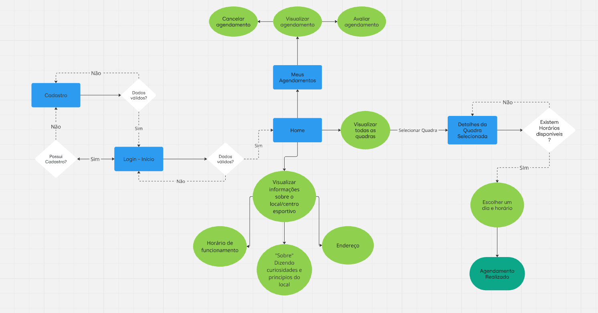
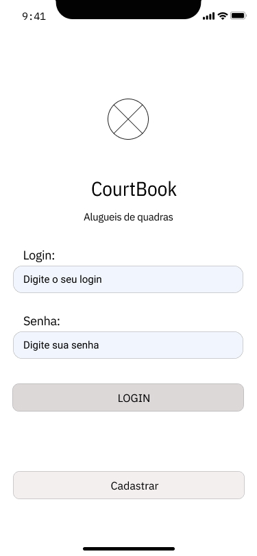
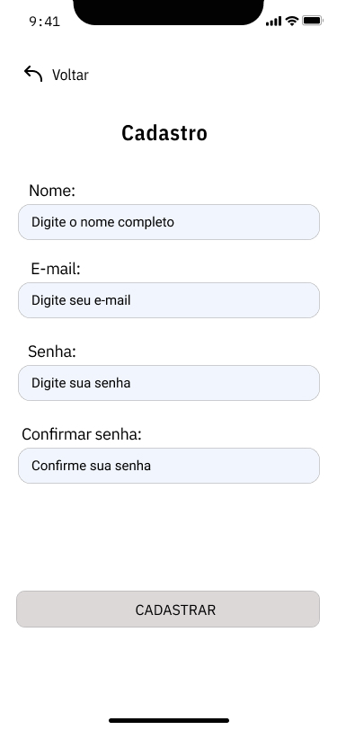
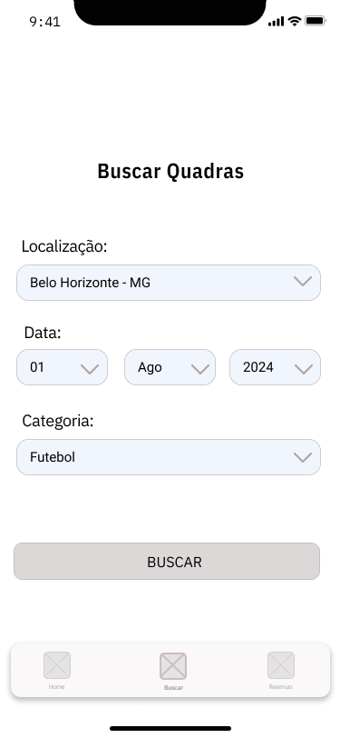
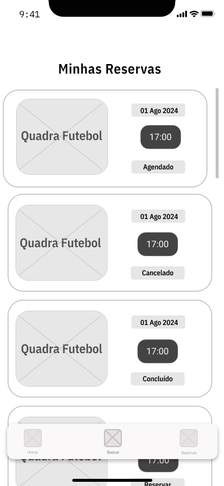

# Projeto de Interface

## Diagrama de Fluxo

O diagrama abaixo apresenta o fluxo de interação do usuário com o sistema,tendo seu início no Login e prosseguindo com as demais interações possíveis no aplicativo.

## Wireframes

As telas principais incluem login, cadastro, busca de quadras e minhas reservas. As demais telas, como os resultados de busca e os detalhes das reservas, estão localizadas na pasta de imagens [Wireframes](https://github.com/ICEI-PUC-Minas-PMV-ADS/pmv-ads-2024-2-e3-proj-mov-t4-courtbook/tree/main/docs/img/Wireframe_CourtBook).

* Tela de login

* Tela de cadastro

* Tela de busca

* Tela Minhas Reservas

