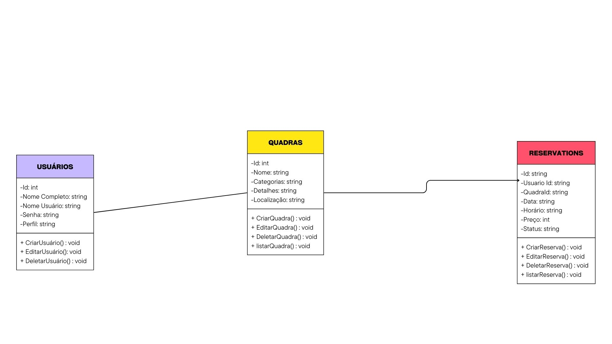

# Arquitetura da Solução

<span style="color:red">Pré-requisitos: <a href="3-Projeto de Interface.md"> Projeto de Interface</a></span>

Definição de como o software é estruturado em termos dos componentes que fazem parte da solução e do ambiente de hospedagem da aplicação.


## Diagrama de Classes

O diagrama de classes ilustra graficamente como será a estrutura do software, e como cada uma das classes da sua estrutura estarão interligadas. Essas classes servem de modelo para materializar os objetos que executarão na memória.



## Documentação do Banco de Dados MongoDB


A escolha do MongoDB como banco de dados para o CourtBook foi estrategicamente alinhada com as necessidades específicas de um sistema de gerenciamento de quadras esportivas. Aqui estão as principais razões e vantagens desta escolha:

### 1. Flexibilidade na Modelagem de Dados

O MongoDB, sendo um banco de dados baseado em documentos, oferece uma flexibilidade excepcional na modelagem dos dados, o que é crucial para nossa aplicação por várias razões:

- *Estrutura Dinâmica*: As quadras esportivas podem ter diferentes características e atributos dependendo do tipo de esporte. Por exemplo, uma quadra de futsal pode ter atributos diferentes de uma quadra de tênis. O MongoDB permite adicionar ou modificar campos sem necessidade de alteração do esquema.
-  *Documentos Aninhados*: A estrutura de documentos do MongoDB permite representar naturalmente relacionamentos complexos, como a localização das quadras e detalhes específicos.

### 2. Escalabilidade

Considerando os requisitos não funcionais do projeto (RNF-004 e RNF-005), que exigem desenvolvimento distribuído e alta disponibilidade, o MongoDB oferece:

- *Sharding Nativo*: Permite distribuir dados entre múltiplos servidores conforme o sistema cresce
- *Replicação Integrada*: Garante alta disponibilidade e redundância dos dados
- *Escalabilidade Horizontal*: Facilita a adição de mais servidores conforme a demanda aumenta

### 3. Suporte a Dados em Tempo Real

O sistema precisa lidar com atualizações em tempo real de reservas e disponibilidade de quadras. O MongoDB facilita:

- *Operações em Tempo Real*: Atualizações rápidas do status das reservas
- *Change Streams*: Permite monitorar mudanças em tempo real
- *Consistência Eventual*: Modelo que favorece a disponibilidade em um sistema distribuído


## Esquema do Banco de Dados
### Coleção: usuarios
Armazena as informações dos usuários do sistema (clientes e administradores de quadras).
Estrutura do Documento

```Json
{
    "_id": 1,
    "nomeCompleto": "Carlos Silva",
    "nomeUsuario": "carlos.silva",
    "email": "carlos.silva@example.com",
    "senha": "hash_da_senha",
    "perfil": ["admin", "user"],    
    "createdAt": "2025-03-18T10:00:00Z",
    "updatedAt": "2025-03-18T12:00:00Z"
}
```

#### Descrição dos Campos
> - <strong>_id:</strong> Identificador único do usuário.
> - <strong>nomeCompleto:</strong> Nome completo do usuário.
> - <strong>nomeUsuario:</strong> Idendificador de usuário.
> - <strong>email:</strong> Endereço de email do usuário.
> - <strong>senha:</strong> Hash da senha do usuário.
> - <strong>perfil:</strong> Lista de papéis atribuídos ao usuário (por exemplo, admin, user).
> - <strong>createdAt:</strong> Data e hora de criação do usuário.
> - <strong>updatedAt:</strong> Data e hora da última atualização dos dados do usuário.

### Coleção: quadras
Armazena as informações das quadras disponíveis para reserva.

```Json
{
    "_id": 1,
    "nome": "Quadra Society Central",
    "categoria": "Futebol"
    "detalhes": "Quadra de grama sintética com iluminação noturna.",
    "localização": {
        "endereço": "Rua das Palmeiras, 123",
        "cidade": "Belo Horizonte",
        "estado": "MG"
    },    
    "createdAt": "2025-03-18T10:30:00Z",
    "updatedAt": "2025-03-18T11:30:00Z"
}
```

#### Descrição dos Campos
> - <strong>_id: </strong>Identificador único da quadra.
> - <strong>nome: </strong>Nome da quadra.
> - <strong>categoria: </strong>Tipo de esporte praticado.
> - <strong>detalhes: </strong>Breve descrição sobre a quadra.
> - <strong>localização: </strong>Objeto contendo endereço, cidade e estado da quadra.
> - <strong>createdAt: </strong>Data e hora de criação da quadra.
> - <strong>updatedAt: </strong>Data e hora da última atualização dos dados da quadra.

### Coleção: reservations
Armazena as informações das reservas feitas pelos usuários.

Estrutura do Documento

```Json
{
    "_id": "ObjectId('65f7e1ddf9b2a4f1a9c38b9a3')",
    "usuarioId": "ObjectId('65f7e1bbf9b2a4f1a9c38b9a1')",
    "quadraId": "ObjectId('65f7e1ccf9b2a4f1a9c38b9a2')",
    "data": "2025-03-20",
    "horário": "18:00-20:00",
    "preço": 240.00,
    "status": "confirmed",
    "createdAt": "2025-03-18T11:00:00Z",
    "updatedAt": "2025-03-18T11:30:00Z"
}
```

#### Descrição dos Campos
> - <strong>_id: </strong>Identificador único da reserva.
> - <strong>usuarioId: </strong>Referência ao usuário que fez a reserva.
> - <strong>quadraId: </strong>Referência à quadra reservada.
> - <strong>data: </strong>Data da reserva.
> - <strong>horário: </strong>Faixa de horário reservada.
> - <strong>preço: </strong>Preço total da reserva baseado no tempo.
> - <strong>status: </strong>Status atual da reserva (pending, confirmed, canceled).
> - <strong>createdAt: </strong>Data e hora de criação da reserva.
> - <strong>updatedAt: </strong>Data e hora da última atualização dos dados da reserva.

### Boas Práticas

Validação de Dados: Implementar validação de esquema e restrições na aplicação para garantir a consistência dos dados.

Monitoramento e Logs: Utilize ferramentas de monitoramento e logging para acompanhar a saúde do banco de dados e diagnosticar problemas.

Escalabilidade: Considere estratégias de sharding e replicação para lidar com crescimento do banco de dados e alta disponibilidade.

### Material de Apoio da Etapa

Na etapa 2, em máterial de apoio, estão disponíveis vídeos com a configuração do mongo.db e a utilização com Bson no C#

## Tecnologias Utilizadas

Foram utilizadas diversas tecnologias no projeto para garantir uma aplicação moderna, escalável e eficiente. No Front-End, foi utilizado o React.js como biblioteca principal para construção das interfaces. Para a estilização, a equipe optou por styled-components,uma abordagem utilitária e responsiva.No Mobile optamos pela utilização do React Native visto que o custo para desenvolver seria menor já que a equipe ja tem conhecimento nessa stack.

No Back-End, foi adotado o NestJS, um framework robusto baseado em Node.js, que oferece uma estrutura modular e escalável para desenvolvimento de APIs REST. O banco de dados utilizado foi o PostgreSQL, e o acesso a ele foi gerenciado através do TypeORM, um ORM que facilita a manipulação de dados em bancos relacionais usando TypeScript.Também utilizamos o C# como um dos backends e para a API que fará a comunicação entre esses dois backends optamos pela Node.js,já que oferece um ambiente simples e prático para criação de API's

## Hospedagem

Explique como a hospedagem e o lançamento da plataforma foi feita.

> **Links Úteis**:
>
> - [Website com GitHub Pages](https://pages.github.com/)
> - [Programação colaborativa com Repl.it](https://repl.it/)
> - [Getting Started with Heroku](https://devcenter.heroku.com/start)
> - [Publicando Seu Site No Heroku](http://pythonclub.com.br/publicando-seu-hello-world-no-heroku.html)
