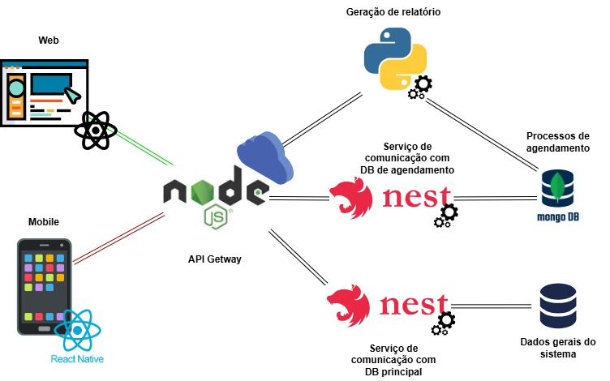

# Arquitetura da Solução

<span style="color:red">Pré-requisitos: <a href="3-Projeto de Interface.md"> Projeto de Interface</a></span>

Definição de como o software é estruturado em termos dos componentes que fazem parte da solução e do ambiente de hospedagem da aplicação.



## Diagrama de Classes

O diagrama de classes ilustra graficamente como será a estrutura do software, e como cada uma das classes da sua estrutura estarão interligadas. Essas classes servem de modelo para materializar os objetos que executarão na memória.

As referências abaixo irão auxiliá-lo na geração do artefato “Diagrama de Classes”.

> - [Diagramas de Classes - Documentação da IBM](https://www.ibm.com/docs/pt-br/rational-soft-arch/9.6.1?topic=diagrams-class)
> - [O que é um diagrama de classe UML? | Lucidchart](https://www.lucidchart.com/pages/pt/o-que-e-diagrama-de-classe-uml)

## Documentação do Banco de Dados MongoDB

Este documento descreve a estrutura e o esquema do banco de dados não relacional utilizado por nosso projeto, baseado em MongoDB. O MongoDB é um banco de dados NoSQL que armazena dados em documentos JSON (ou BSON, internamente), permitindo uma estrutura flexível e escalável para armazenar e consultar dados.

## Esquema do Banco de Dados
### Coleção: usuarios
Armazena as informações dos usuários do sistema (clientes e administradores de quadras).
Estrutura do Documento

```Json
{
    "_id": 1,
    "nomeCompleto": "Carlos Silva",
    "nomeUsuario": "carlos.silva",
    "email": "carlos.silva@example.com",
    "senha": "hash_da_senha",
    "perfil": ["admin", "user"],    
    "createdAt": "2025-03-18T10:00:00Z",
    "updatedAt": "2025-03-18T12:00:00Z"
}
```

#### Descrição dos Campos
> - <strong>_id:</strong> Identificador único do usuário.
> - <strong>nomeCompleto:</strong> Nome completo do usuário.
> - <strong>nomeUsuario:</strong> Idendificador de usuário.
> - <strong>email:</strong> Endereço de email do usuário.
> - <strong>senha:</strong> Hash da senha do usuário.
> - <strong>perfil:</strong> Lista de papéis atribuídos ao usuário (por exemplo, admin, user).
> - <strong>createdAt:</strong> Data e hora de criação do usuário.
> - <strong>updatedAt:</strong> Data e hora da última atualização dos dados do usuário.

### Coleção: quadras
Armazena as informações das quadras disponíveis para reserva.

```Json
{
    "_id": 1,
    "nome": "Quadra Society Central",
    "categoria": "Futebol"
    "detalhes": "Quadra de grama sintética com iluminação noturna.",
    "localização": {
        "endereço": "Rua das Palmeiras, 123",
        "cidade": "Belo Horizonte",
        "estado": "MG"
    },    
    "createdAt": "2025-03-18T10:30:00Z",
    "updatedAt": "2025-03-18T11:30:00Z"
}
```

#### Descrição dos Campos
> - <strong>_id: </strong>Identificador único da quadra.
> - <strong>nome: </strong>Nome da quadra.
> - <strong>categoria: </strong>Tipo de esporte praticado.
> - <strong>detalhes: </strong>Breve descrição sobre a quadra.
> - <strong>localização: </strong>Objeto contendo endereço, cidade e estado da quadra.
> - <strong>createdAt: </strong>Data e hora de criação da quadra.
> - <strong>updatedAt: </strong>Data e hora da última atualização dos dados da quadra.

### Coleção: reservations
Armazena as informações das reservas feitas pelos usuários.

Estrutura do Documento

```Json
{
    "_id": "ObjectId('65f7e1ddf9b2a4f1a9c38b9a3')",
    "usuarioId": "ObjectId('65f7e1bbf9b2a4f1a9c38b9a1')",
    "quadraId": "ObjectId('65f7e1ccf9b2a4f1a9c38b9a2')",
    "data": "2025-03-20",
    "horário": "18:00-20:00",
    "preço": 240.00,
    "status": "confirmed",
    "createdAt": "2025-03-18T11:00:00Z",
    "updatedAt": "2025-03-18T11:30:00Z"
}
```

#### Descrição dos Campos
> - <strong>_id: </strong>Identificador único da reserva.
> - <strong>usuarioId: </strong>Referência ao usuário que fez a reserva.
> - <strong>quadraId: </strong>Referência à quadra reservada.
> - <strong>data: </strong>Data da reserva.
> - <strong>horário: </strong>Faixa de horário reservada.
> - <strong>preço: </strong>Preço total da reserva baseado no tempo.
> - <strong>status: </strong>Status atual da reserva (pending, confirmed, canceled).
> - <strong>createdAt: </strong>Data e hora de criação da reserva.
> - <strong>updatedAt: </strong>Data e hora da última atualização dos dados da reserva.

### Boas Práticas

Validação de Dados: Implementar validação de esquema e restrições na aplicação para garantir a consistência dos dados.

Monitoramento e Logs: Utilize ferramentas de monitoramento e logging para acompanhar a saúde do banco de dados e diagnosticar problemas.

Escalabilidade: Considere estratégias de sharding e replicação para lidar com crescimento do banco de dados e alta disponibilidade.

### Material de Apoio da Etapa

Na etapa 2, em máterial de apoio, estão disponíveis vídeos com a configuração do mongo.db e a utilização com Bson no C#

## Tecnologias Utilizadas

Descreva aqui qual(is) tecnologias você vai usar para resolver o seu problema, ou seja, implementar a sua solução. Liste todas as tecnologias envolvidas, linguagens a serem utilizadas, serviços web, frameworks, bibliotecas, IDEs de desenvolvimento, e ferramentas.

Apresente também uma figura explicando como as tecnologias estão relacionadas ou como uma interação do usuário com o sistema vai ser conduzida, por onde ela passa até retornar uma resposta ao usuário.

## Hospedagem

Explique como a hospedagem e o lançamento da plataforma foi feita.

> **Links Úteis**:
>
> - [Website com GitHub Pages](https://pages.github.com/)
> - [Programação colaborativa com Repl.it](https://repl.it/)
> - [Getting Started with Heroku](https://devcenter.heroku.com/start)
> - [Publicando Seu Site No Heroku](http://pythonclub.com.br/publicando-seu-hello-world-no-heroku.html)

## Qualidade de Software

Conceituar qualidade de fato é uma tarefa complexa, mas ela pode ser vista como um método gerencial que através de procedimentos disseminados por toda a organização, busca garantir um produto final que satisfaça às expectativas dos stakeholders.

No contexto de desenvolvimento de software, qualidade pode ser entendida como um conjunto de características a serem satisfeitas, de modo que o produto de software atenda às necessidades de seus usuários. Entretanto, tal nível de satisfação nem sempre é alcançado de forma espontânea, devendo ser continuamente construído. Assim, a qualidade do produto depende fortemente do seu respectivo processo de desenvolvimento.

A norma internacional ISO/IEC 25010, que é uma atualização da ISO/IEC 9126, define oito características e 30 subcaracterísticas de qualidade para produtos de software.
Com base nessas características e nas respectivas sub-características, identifique as sub-características que sua equipe utilizará como base para nortear o desenvolvimento do projeto de software considerando-se alguns aspectos simples de qualidade. Justifique as subcaracterísticas escolhidas pelo time e elenque as métricas que permitirão a equipe avaliar os objetos de interesse.

> **Links Úteis**:
>
> - [ISO/IEC 25010:2011 - Systems and software engineering — Systems and software Quality Requirements and Evaluation (SQuaRE) — System and software quality models](https://www.iso.org/standard/35733.html/)
> - [Análise sobre a ISO 9126 – NBR 13596](https://www.tiespecialistas.com.br/analise-sobre-iso-9126-nbr-13596/)
> - [Qualidade de Software - Engenharia de Software 29](https://www.devmedia.com.br/qualidade-de-software-engenharia-de-software-29/18209/)
