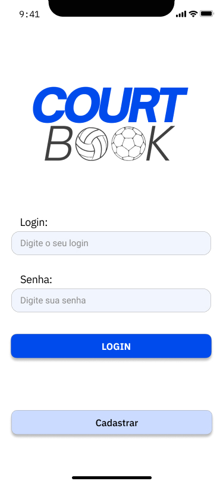
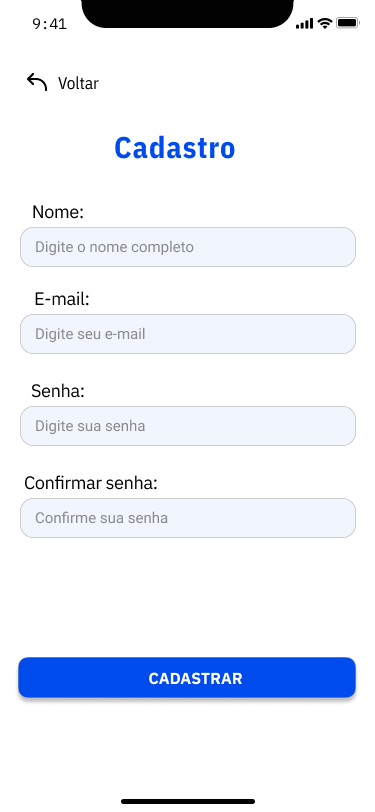
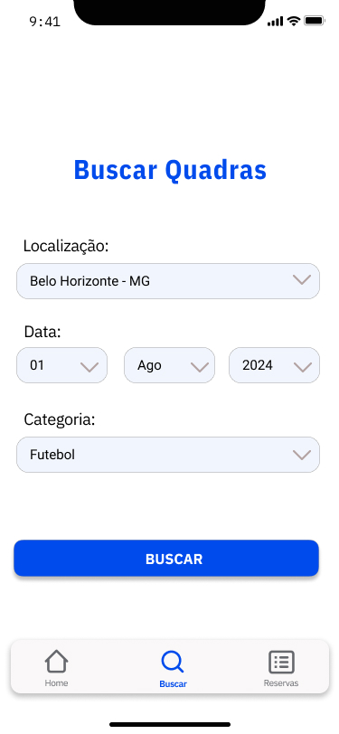
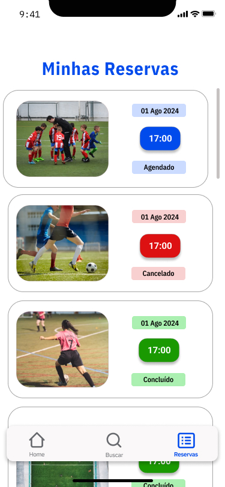

# Template Padrão da Aplicação

O design das telas do aplicativo CourtBook segue um template padrão que garante uma experiência de usuário consistente e intuitiva. Este template inclui elementos de interface como a logo na tela de login, campos de entrada, botões de ação, e layouts de navegação. O objetivo é proporcionar uma navegação clara e eficiente para os usuários, facilitando o acesso às funcionalidades do aplicativo.

As demais telas podem ser consultadas na pasta [Template](https://github.com/ICEI-PUC-Minas-PMV-ADS/pmv-ads-2024-2-e3-proj-mov-t4-courtbook/tree/main/docs/img/Template_CourtBook).

* Tela de login

* Tela de cadastro

* Tela de busca

* Tela de busca

