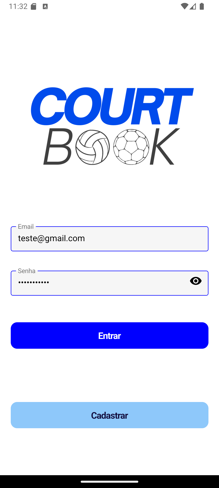
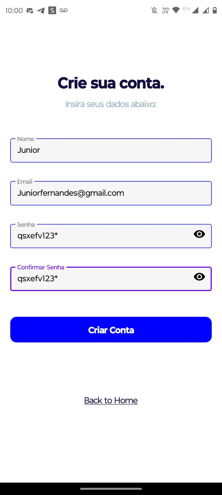
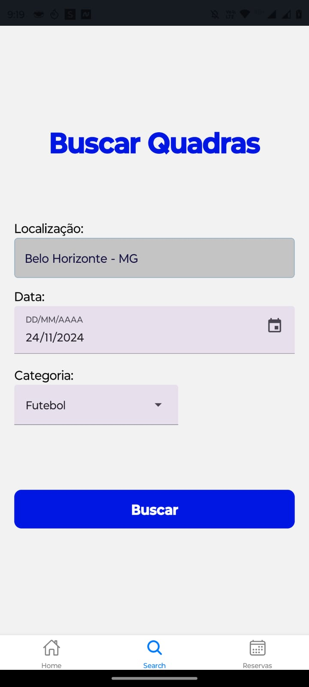
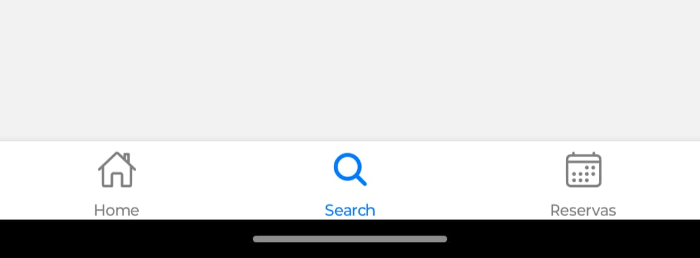
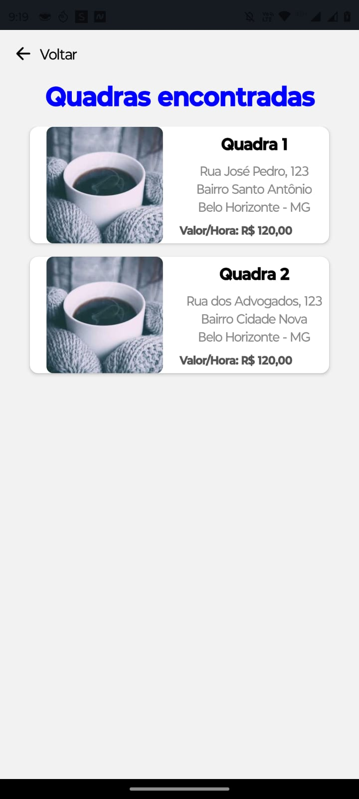

# Registro de Testes de Software

Pré-requisitos: <a href="3-Projeto de Interface.md"> Projeto de Interface</a>, <a href="8-Plano de Testes de Software.md"> Plano de Testes de Software</a>

Relatório com as evidências dos testes de software realizados no sistema pela equipe, baseado em um plano de testes pré-definido.

Para cada caso de teste definido no Plano de Testes de Software, realize o registro das evidências dos testes feitos na aplicação pela equipe, que comprovem que o critério de êxito foi alcançado (ou não!!!). Para isso, utilize uma ferramenta de captura de tela que mostre cada um dos casos de teste definidos (obs.: cada caso de teste deverá possuir um vídeo do tipo _screencast_ para caracterizar uma evidência do referido caso).

| **Caso de Teste** 	| **CT-01 – Realizar Login** 	|
|:---:	|:---:	|
|	Requisito Associado 	| RF-001 - Deve permitir aos usuários fazerem login. |
|Registro de evidência | 

 |

Foi Realizado uma simulação de preenchimento de formulário por parte do usuário, assim os dados passam por uma validação que se retornar true o usuário é logado e redirecionado para a tela Home.

| **Caso de Teste** 	| **CT-02 – Realizar Cadastro** 	|
|:---:	|:---:	|
|	Requisito Associado 	| RF-002 - Deve permitir aos usuários realizarem um cadastro. |
|Registro de evidência | 

 |

Foi realizada uma simulação de preenchimento de formulário de cadastro com inserção de nome, email, senha, e confirmação de senha por parte do usuário, desta forma os dados passam por uma verificação, confirmação de senha e de restrições para o demais campos, que caso sejam válidos, criam os devidos dados no arquivo json de forma estruturada, redirecionado para a tela Login.

| **Caso de Teste** 	| **CT-04 – Visualizar dias e horários disponíveis** 	|
|:---:	|:---:	|
|	Requisito Associado 	| RF-004 - O sistema deve permitir que o cliente visualize os dias e horários disponíveis nas quadras. |
| Registro de evidência | <video src="https://github.com/user-attachments/assets/058edcfd-d964-45b5-a49c-b46923690afd"></video> |
| Descrição | Foi realizada uma simulação onde o usuário acessou o sistema, navegou até a página de agendamento e verificou a disponibilidade de horários para as quadras. O sistema exibiu corretamente o calendário com os dias e horários disponíveis para reserva, permitindo uma visualização clara das opções de agendamento. O teste demonstrou que o requisito foi atendido com sucesso, pois o usuário conseguiu visualizar todos os horários vagos de forma organizada. |

| **Caso de Teste** 	| **CT-05 – Cancelamento de agendamento** 	|
|:---:	|:---:	|
|	Requisito Associado 	| RF-005 - O sistema deve permitir ao cliente cancelar um agendamento. |
| Registro de evidência |  <video src="https://github.com/user-attachments/assets/82b3251c-07da-44db-b173-bd51321a17f9"></video> |
| Descrição | Foi realizada uma simulação do processo de cancelamento de agendamento, onde o usuário acessou o sistema, navegou até a área de agendamentos, selecionou um agendamento existente e realizou o cancelamento. O sistema processou a solicitação corretamente, exibindo a mensagem de confirmação do cancelamento, demonstrando que o requisito foi atendido com sucesso. |

| **Caso de Teste** 	| **CT-07 – Buscar Quadras** 	|
|:---:	|:---:	|
|	Requisito Associado 	| RF-007 - Deve permitir ao cliente visualizar os tipos de quadra pela sua categoria. |
|Registro de evidência | 

 |

Foi realizada uma simulação de preenchimento de formulário de buca por quadras com inserção de localização, data e categoria, desta forma os dados expecificados na pesquisa são recuperados do banco de dados, redirecionado para a tela de listagem de quadras.

| **Caso de Teste** 	| **CT-09 – Menu de Navegação** 	|
|:---:	|:---:	|
|	Requisito Associado 	| RF-009 - Deve permitir o cliente navegar entre as páginas da aplicação. |
|Registro de evidência | 

 |

Foi realizada uma simulação de navegação entre as páginas ao selecionar cada icone, confirmando o redirecionamento para as páginas especificas.

| **Caso de Teste** 	| **CT-12 – Resultado Quadras** 	|
|:---:	|:---:	|
|	Requisito Associado 	| RF-012 - Deve permitir ao usuário visualizar o espaço a ser locado. |
|Registro de evidência | 

 |

Foi realizada uma simulação de preenchimento de formulário de quadras, e este envia os dados necessários para uma filtragem de quadras que são exibidas nesta página de listagem, confirmando o retorno no backend para a listagem da página de acordo com os dados requeridos.

| **Caso de Teste** 	| **CT-13 – Agendamento do espaço** 	|
|:---:	|:---:	|
|	Requisito Associado 	| RF-013 - O sistema deve permitir ao cliente agendar o espaço. |
|Registro de evidência | <video src="https://github.com/user-attachments/assets/9561d9b0-8ee1-499c-bf00-435219dc33a2"></video> |
| Descrição | Foi realizada uma simulação completa do processo de agendamento, onde o usuário acessou o sistema, navegou até a área de agendamento, selecionou uma quadra disponível e seu respectivo horário, e finalizou confirmando o agendamento. O sistema processou a solicitação corretamente (alguns erros são comuns já que estamos utilizando uma conexão instável de tunnel, pois não podemos criar um backend de fato), exibindo a mensagem de confirmação do agendamento, demonstrando que o requisito foi atendido com sucesso. |

